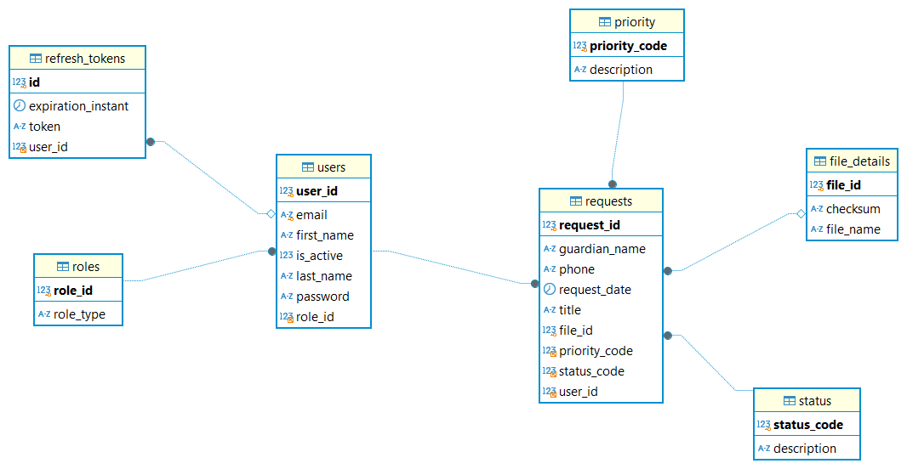

# RequestManagement (Spring REST API)

Request Management Service is Spring-based REST API that interacts with an SQL database, providing various endpoints for request management. This API is designed to follow industry best practices, ensuring scalability, security, and ease of use. It includes robust features such as pagination, sorting, JWT authentication, and more.

## Features

### 1. **Industry-Level API Design Pattern**

The API follows a clean and modular architecture with appropriate separation of concerns. The design pattern ensures flexibility and scalability, making it easier to maintain and extend.

- **Controllers:** Handle HTTP requests and delegate to appropriate service layer methods.
- **Service Layer:** Contains business logic.
- **Repository Layer:** Interacts with the database using Spring Data JPA.
- **DTOs and Entities:** Data transfer objects (DTOs) are used to encapsulate data that is sent to the client, while entities map to the database schema.

### 2. **Sorting & Pagination Using Query Parameters**

The API supports sorting and pagination for endpoints that return lists of items, reducing the load on the server and improving the user experience.

- **Query Parameters:**
    - `page_number`: The page number for pagination (default is 1).
    - `page_size`: The number of items per page (default is 20).
    - `sort_field`: The field used to sort the records
    - `sort_direction`: Optional sorting direction ascending (default) or descending (`asc` or `desc`).

Example:
```
GET /api/requests?pageSize=20&pageNumber=7&sortField=requestId&sortDirection=desc
```

### 3. **Query Parameter Validation**

The API ensures that query parameters, including pagination parameters and sorting fields, are validated properly. Invalid inputs return a 400 Bad Request response with clear error messages, ensuring users provide correct parameters.

- **Validation Example:**
    - If a non-existing sorting field is passed, an error message is returned.
    - Invalid page or size values (e.g., negative numbers) are rejected.

### 4. **API Documentation Using Swagger (OpenAPI)**

The API is documented using **Swagger UI** (OpenAPI), making it easy for developers to explore and test the endpoints interactively.

- **Swagger UI URL**: Access the Swagger UI at the following URL:
  ```
  GET /swagger-ui/index.html
  ```
- Swagger provides detailed information about each endpoint, including request/response formats, query parameters, and more.
- API documentation in JSON format can be found at `/v3/api-docs`

### 5. **Spring Security with RBAC Authentication and Authorization**

The API is secured with **Spring Security** and uses **Role-Based Access Control (RBAC)** to restrict access to certain endpoints.

- **Authentication:**
    - Users authenticate using a username and password.
    - Roles are assigned to users (e.g., `ADMIN`, `USER`) and are used to authorize access to specific endpoints.

- **Authorization:**
    - Endpoints are protected by role-based permissions. For example, an endpoint for creating an item may require the user to have an `ADMIN` role.

- Access control is enforced at the controller level using annotations like `@PreAuthorize`.

### 6. **JWT and Refresh Token Implementation for Enhanced Security**

The API uses **JSON Web Tokens (JWT)** for authentication. JWTs are issued after a successful login and must be included in the `Authorization` header for subsequent requests.

- **JWT:**
    - Upon successful authentication, the server generates a JWT and returns it to the client.
    - The client stores the JWT (usually in local storage or cookies) and includes it in the `Authorization` header for all future requests.

- **Refresh Tokens:**
    - To improve security, the API also supports refresh tokens. Refresh tokens allow users to obtain a new access token when the original JWT expires, without needing to re-authenticate.

### 7. **Spring Logging with Logback and Log Rotation**

The API uses **Logback** for logging and is configured for **log rotation** to prevent logs from growing indefinitely. Logs provide detailed insights into application events, which can be helpful for debugging and monitoring.

- **Logback Configuration**: Logs are written to files, with the logs being rotated daily. The path for logs files is `PROJECT_ROOT/logs`
- **Log Levels**: Various log levels (`DEBUG`, `INFO`, `ERROR`) are used for different types of messages.
- **Log Format**: Logs are structured for easy readability, containing useful context like timestamps, log level, and message.

### 8. **Centralized Exception Handling with Global Exception Handler**

The API handles exceptions globally using a **Global Exception Handler**. This ensures consistency in error responses and makes it easier to manage exceptions.

- **Global Exception Handler**:
    - Catches all exceptions thrown from the controllers or service layer.
    - Returns a standardized error response with HTTP status code, error message, and any relevant details.

- **Custom Exceptions**:
    - Custom exceptions (e.g., `ResourceNotFoundException`, `UnauthorizedServiceException`) are defined to handle specific error cases.

## Database ER Diagram




## Getting Started

### Prerequisites

- JDK 11 or later
- Maven
- A running SQL database (e.g., MySQL, PostgreSQL)

### Installation

1. Clone the repository:
   ```bash
   git clone https://github.com/ashutosh2706/request_api_spring.git
   ```

2. Navigate to the project directory:
   ```bash
   cd request_api_spring
   ```

3. Install dependencies and build the project using Maven:
   ```bash
   mvn clean install
   ```

4. Configure the database connection in `application.properties` or `application.yml`:
   ```properties
   spring.datasource.url=jdbc:mysql://localhost:3306/yourdb
   spring.datasource.username=yourusername
   spring.datasource.password=yourpassword
   ```

5. Run the application:
   ```bash
   mvn spring-boot:run
   ```

6. Access the Swagger UI at:
   ```
   http://localhost:8080/swagger-ui/index.html
   ```
